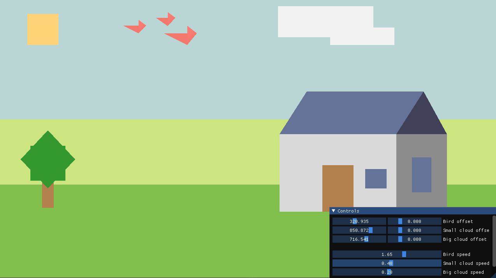

# OpenGL-SimpleVillage
A practice project that shows a simple village drawn with the use of OpenGL and C++.

## Description

You can control the position and speed of two clouds and birds. When they exit the screen on one of the sides, they will appear from the opposite one.

This project uses concepts of batch rendering.

_*The main "OpenGL-Village" project is inside the [OpenGL-Sandbox](OpenGL-Sandbox/) directory._

## Credits

- [OpenGLCore](https://github.com/TheCherno/OpenGL) by [TheCherno](https://github.com/TheCherno)
- [ImGui](https://github.com/ocornut/imgui)
- [Glad](https://github.com/Dav1dde/glad)
- [GLFW](https://www.glfw.org/)
